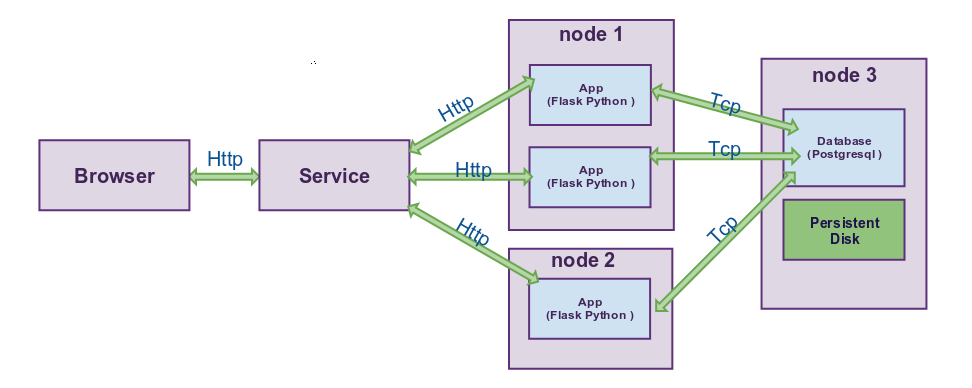

## Example of deploying an application (app and database) using Helm in a cluster Kubernetes.

      This application is intended for the practical mastering of kubernetes and helm.
  ---
### The application consists of two micro-services:

- Service written in python - just a blog, implemented to demonstrate the work with the database, works through uwsgi.

- Database postgresql for data storage, this application uses the scheme of working with nfs disk.

**Micro services interconnection scheme**:

---

### Что такое Helm ?
Есть пакетные менеджеры apt / yum / dnf /  homebrew и т.д. для удобного разворота приложении на операциооных системах, helm примерно тоже самое только для Kubernetes. Helm - это инструмент, который упрощает установку и управление приложениями Kubernetes.

- Helm состоит из двух частей: клиента (helm) устанавливаеться на рабочую станцию, достаточно скачать bin фаил для своеи системы из [GitRepoHelm](https://github.com/kubernetes/helm) и положить в /usr/bin  с которой будем выполнять удаленные команды к кластеру kubernetes и серверная часть (tiller), серверная часть устанавливаеться просто командои **helm init**
---
### Лучше один раз попробовать, чем много читать о kubernetes? Даваите попробуем, развернем exampleapp !
1. Сначало нужно скачать и установить minikube на свою машину, просто переходим по ссылке  [minikube ](https://github.com/kubernetes/minikube/releases), там есть версии для всех операционных систем и команды для установки. Установить виртуальную среду в свое ОС, minikube требует
  * OS X
    - xhyve driver, VirtualBox or VMware Fusion installation
  * Linux
    - VirtualBox or KVM installation,
  * Windows
    - Hyper-V
  * VT-x/AMD-v virtualization must be enabled in BIOS

> Если будут возникать проблемы с установкои виртуальнои среды в ОС, нужно отключить secure boot в BIOS(UEFI) или сгенерить ключи для secure boot.

2. Запустим minikube командои из консоли **minikube start**, minikube создаст виртуальную машину и запустит в неи kubernetes, добавит все необходимы credentials для доступа к кластеру kubernetes в фаил ~/.kube/config.
3. Далее нужно добавить автодополнения для **minikube** по следующему гаиду [minikube_completion](https://github.com/kubernetes/minikube/blob/master/docs/minikube_completion.md), данныи пункт можно делать по желанию, функционал просто устанавливает автодополнения для **minikube**.
3. Уже сеичас можно управлять кластером, через **kubectl**, для проверки можно выполнить команду **kubectl get nodes**, в результате выполнения команды должно выдать ноду например **minikube   Ready     9d** или выполнит команду **kubectl get all -n kube-system**, в ввыводе будут все системные поды для работы кластера. Ну и напоследок **kubectl --help**.
5. Далее нужно установить Helm на свою машину, просто скачивам bin фаилы в свои **/usr/local/bin** от сюда [helm](https://github.com/kubernetes/helm), для пользователеи osx можно просто выполнить команду **brew install kubernetes-helm**.
6. Инсталируем **Helm** сервер(**tiller**) в наш новыи кластер, командои **helm init**, после выполнения даннои команды можно увидеть в кластере, что появился под **tiller** - выплняем команду **kubectl get all -n kube-system** видим новыи под пример **rs/tiller-deploy-3299276078**
7. Клонируем репозитории [k8swar](https://stash.wargaming.net/projects/CLANWARS/repos/k8swar/browse).
8. Заходим в папку **./k8swar/helm/k8swarcharts/exampleapp**, в фаиле **values.yaml** в секции **app** меняем парметр **externalIPs** на ip которыи выдаст команда **minikube ip**, параметр **HostName** должен быть закоментирован , если не хотим поднимать ингерсс контроллер. Теперь  если необходимо, что бы база имела реальныи nfs диск и данные хранились на нем,  нужно сначало поднять nfs диск пример гаида [nfsdisk-gaid](https://www.digitalocean.com/community/tutorials/how-to-set-up-an-nfs-mount-on-centos-6), далее в фаиле  **values.yaml**  в секции db -> Persistence установить параметр Enabled в true и поменяите парметры **nfspath**, nfsserver на свои. Если Бд не нужен диск тогда  в секции **db -> Persistence** установить параметр Enabled в false.
9. Все готово инсталируем приложение, выполняем команду **make run** из каталога **./k8swar/helm/k8swarcharts/exampleapp**. Все переменные и команды по сборке и оперированию проектом описанны в **makefile**, описание команд можно посмотреть выполнив команду **make help** .
10. Проверяем **make status** или **kubectl get all -n exampleapp** , что все взлетело.
11. Теперь нужно выполнить миграцию БД, выполняем команду **kubectl get pod -n exampleapp** из списка нам нужен под с app пример названия **blog-exampleapp-2137136626-bz33p**.
12. Заидем в сам под с помощью kubectl и выполним миграцию **kubectl -n exampleapp exec blog-exampleapp-2137136626-bz33p   -i -t -- bash -il**, зашли в контеинер выполняем миграцию БД **python ./db_create.py && python ./db_migrate.py**
13. По ip из результат команды **minikube ip** заходим через браузер, видим приложение. Теперь нужно зарегистрирвоаться в системе регистрируемся, далее входим. Можно так же заити в систему через локаишен **/loginopenid** в данном случае аутентификация будет с помощью логина openid можно зарегистрировать аккаунт на yahoo, aol или flickr.
14. Когда захотите удалить приложения, достаточно просто выполнить команду **make purge**.

### Как еще можно попрактиковаться с Helm ?

- Можно ознакомиться и реализовать **hello word** Chart для Helm по этому [hello word](https://hackernoon.com/the-missing-ci-cd-kubernetes-component-helm-package-manager-1fe002aac680#.ujhdretpb) гаиду.  
